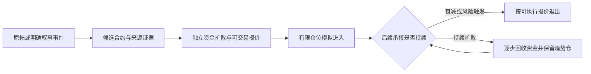

# BSC meme 盈利方向与证据复核（2026-09-16）

## 结论和优先级

目前最值得优先验证的是：**明确叙事来源 → 正确合约映射 → 独立资金接力确认 → 有限仓位进入 → 弱势退出、强势分段持有**。这是一条可解释、能逐事件验证的研究路线，还没有证据能称它为“最赚钱策略”。

本轮不能给出可信的最优买入市值、最佳持有时长或预期收益率。原因已经落实到具体代码和链上记录：此前的实验在报价资产、事件类型、执行判断和资金记账上都存在实质性错误。继续优化旧结果会优化错误的测量。修复测量和对齐交易范围应排在模型/参数搜索之前。

“最大收益”和“最高成功概率”也不是同一目标。增加仓位会同时放大盈利与亏损，低胜率策略可能依靠少数大赢家，较高胜率也可能被一次崩盘抵消。这里建议的目标是：**限定资金和最大可承受损失后，最大化扣除手续费、gas、滑点、失败交易和数据成本的账户收益，并保留大赢家的收益空间**。不能仅最大化胜率或历史最高涨幅。

## 本轮核验出了什么

本轮固定审计 2026-09-14 的 615 个旧候选，以保留与旧报告的一一对应；没有混入新数据后宣称旧回测已修复。链上核验在 2026-09-16 北京时间通过 `.env` 的代理完成。报价资产是本轮获取的当前元信息，不冒充历史时点记录。

| 核验项 | 结果 | 含义 |
| --- | ---: | --- |
| 固定候选 | 615 | 全部保留在审计分母中 |
| 原生 BNB 报价 | 18 | 当前执行器的报价支持范围 |
| 非 BNB 报价 | 597（97.1%） | 原有 `bnb_amount` 命名和统一乘 BNB/USD 不成立 |
| 其中 USDT / GMEB | 381 / 169 | 还有 USD1、NVDAB 等报价资产 |
| BNB 候选中假定买入前已迁移到 DEX | 16/18 | 继续拿内盘价格假设内盘买入不可成立 |
| 旧“22 笔可执行”中 BNB 报价 | 0/22 | 这组统计没有对齐当前执行器支持范围 |
| 在第一笔已存买单即满足旧门槛 | 586/615 | 大量记录根本不是观察到从低市值突破门槛 |
| USDT 候选中至少 90% 买单不足 1 USDT | 95 | 多地址/多买单不等于独立真实需求；小单本身不证明操纵 |
| 615 候选的交易事件 | 287,318 | 这批固定文件没有保存可用的逐交易 block/log/tx 身份 |
| 真实执行与实际 BNB 盈亏 | 615 笔均未知 | 不能把代理价格的盈亏当作实盘成交结果 |

逐候选可筛选表：`candidate-audit.csv`；机器可读报告与输入 SHA-256：`candidate-audit.json`。报价原始 RPC 响应：`quote-universe.json`；623 个 token/quote 的 decimals 读取均为 18，8 个 quote 的 symbol 一并存于 `asset-metadata-latest.json`。当前元信息不能证明历史 FX、历史可卖余额或历史合约状态。

### 为什么之前的三个“真实失败”也需要撤回

| 旧案例 | 真实报价资产（当前链上核对） | 原来被写成 USD 的数值 | 实際算出来的口径 |
| --- | --- | ---: | --- |
| 景甜指甲刀 `0x1d9569226d5393609c730ed59319ff4774af4444` | USDT | 约 2,407.6 万美元 | 约 32,793.85 USDT 的交易均价 × 总供应量代理值 |
| 牛来人生 `0x13869585d3e8778f568b6c6cf1a24cadd08a4444` | USDT | 约 2,820.2 万美元 | 约 38,413.79 USDT 的相同代理值 |
| WHISK `0x21f462b87ce24eb95e62aa56c1b8af1d9ba0ffff` | GMEB | 约 41.6 万美元 | 约 566.63 GMEB，美元价值还需同期 GMEB 汇率 |

前两例被额外乘了 734.17 的 BNB/USD 系数。USDT 并非 BNB，也不能假定任何时期完全等于 1 美元；即便近似按 1 美元计，这两例也不到所谓 50k 门槛。第三例的 GMEB 是 BSC 上的 ERC-20 报价资产，并非本轮转向其他链。

小单例子也能逐笔对上：这个牛来人生在确认窗口有 283 笔买单，其中 253 笔不足 1 USDT，合计仅约 0.3711 USDT；景甜指甲刀有 122 笔，其中 92 笔小单合计约 0.3495 USDT。原来的“至少 3 个买家/5 笔买单”会接收这类信号，却没有衡量独立新增资金的质量。

这三例还通过第二个 RPC 提供方的官方 Helper `getTokenInfo` 做了交叉核对（`helper-crosscheck.json`）。它们的原有收益数字只能称为未经验证的价格比值，不能称为三笔真实成交亏损。

### 58 笔近零价格的根因已核实

`keccak256("LiquidityAdded(address,uint256,address,uint256)")` 对应 `c18aa711…`。旧回填器和监听器把这个 topic 当成 `TokenSale`，然后：

- 把加池 `offers` 数量解释成钱包地址；
- 把 `quote` 合约地址解释成售出 token 数量；
- 把 `funds` 解释成卖出收入。

因此产生固定“卖家” `0x000000000000000000a56fa5b99019a5c8000000`、天文数量 token 和近零价格。这个地址恰好是 `200,000,000 × 10^18` 的地址形式，不能据此说真的有一个系统钱包砸盘。

真实链上证据：FOMOCAT 的 [加池交易](https://bscscan.com/tx/0xcb992be33532cd684ffc2dbf3726fc997b71a4bda9266a3b155ec872d49f07f2)，block `117450456`，log `241`。解码是 base=FOMOCAT、offers=200m、quote=GMEB、funds≈637 GMEB。原始响应保存在 `liquidity-logs-rpc.json`。

正确修复是按 ABI 区分事件，保留原始整数和币种；不能设一个低价阈值删除“不好看的亏损”。本轮新增 ABI 解码器并接入**离线回填器**，覆盖现代/旧版买卖、加池和辅助事件。已有数据尚未重建，运行中的监听器/collector 没有热更新，继续积累旧格式数据本身不能消除这些错误。

### 为什么“3 秒内没别人成交就不能卖”不成立

AMM 是和池子储备交易，不要求另一个用户恰好在同一秒成交。旁边有一笔成交，也不能证明我们的下单数量有同样价格。应检验当时的路由、储备、订单量、报价、税/费、交易状态和实际延迟。

所以 22 是“目标时刻后 3 秒内存在价格记录”的数量，不是可执行交易数；19/22 的正价格比值不能证明 86% 胜率，另外 593 笔也不能因为没有同时成交被移出回测分母。详见 Uniswap 官方 [Swaps](https://docs.uniswap.org/contracts/v2/concepts/core-concepts/swaps) 文档和 `replay_audit.md`。

其它已复现问题包括：同秒按价格排序制造走势；用旧确认价当延迟后的买价；把未来很晚的一笔成交当 1 小时卖出；把陈旧估值当已卖出现金；跨 DEX 强行缩放首根价格抹去真实价差；资金时间线可能使用未来卖出款。**现有记录不足以证明长期一定差、短期一定好，也不足以证明原先统一模型的技术方向完全无效。**

## 更适合你的策略结构

### 1. 免费输入从重点来源开始

第一版用 X 自带通知/列表人工跟踪一小组相关来源，提供原帖链接或文本进入本地队列。程序负责映射、核验、记录和模拟。这样可做到数据服务零新增付费，但不能承诺全 X 自动秒级覆盖；交易仍有 gas/手续费/滑点。已有代理只解决连接，不提供 X API 访问权限。

DEX Screener/GeckoTerminal 的公开端点只做辅助当前快照，链上监听和本地原始日志是可重放基础。`boost`/profile/排行榜不能当成独立的 X 原创信号。AI 可从用户提供或合法获取的文本提取概念、态度、引用关系和候选名称；没有 X 数据时不能声称 AI 已经识别了热度来源。

### 2. 分开“明确提币”和“文章衍生币”

- 原帖包含合约地址：先解析 chain+contract，再核对来源与创建事件。
- 大 V 只发了一篇文章或一个梗：生成一个叙事事件，随后同梗的多个币都是候选。不能把第一枚同名币、名字最相似的币或涨得最高的币事后认成原帖指定币。
- 多个候选竞争时看后续真实新资金去向、来源链接、市场深度和买家扩散；无法消除歧义就继续观察。宁可稍晚获得可验证的承接，也不在错误合约上争第一秒。
- 大 V 的粉丝数、买方地址数、交易次数、涨幅都只能说明一个维度。记录“发布时间前是否已涨”“独立作者是否新增”“独立资金是否跟随”；用过去已结束的结果评价来源，禁止用未来赢家反推今日白名单。

### 3. 市值用正确币种和两个边界

`FDV = token 的报价资产价格 × 总供应量 × 同期报价资产/USD`；流通市值需要流通供应，不能混称。使用订单量对应的买/卖报价另行判断流动性。30k、50k、100k 都只是候选阈值，并无已验证的最优值。

买入需满足市值带的下限和上限，以及相对原帖/首次发现时价格的最大追涨距离。旧版只有下限，591/615 在确认时的**旧错误美元口径**已高于 100k。等到 50k 还强制等 30 秒，也可能已经换场或涨到很高；应记录当时能交易的 venue 后作决定。

当前执行器只支持原生 BNB。首轮保持同一支持范围以减少变量；扩大到 USDT/其他 quote 需要独立的兑换路由、费用与资金记账，不能靠改字段名称完成。

### 4. 弱势退出与大赢家长持分开

持有 3–4 天可以作为上限和对照实验，但不能预先保证更好。真正应验证的是买入后持续承接，承接弱化时退出，只有少数持续走强的 token 保留更久。

用于首轮模拟的退出对照保持少量、预先固定：

| 对照 | 作用 | 尚未验证的假设 |
| --- | --- | --- |
| 固定 1 小时退出 | 提供相同入口的基准 | 不能用几天后的成交替代时点报价 |
| 1 小时上限 + 事件衰减退出 | 判断卖压/新资金停滞是否减少亏损 | 触发阈值由开发窗口决定，不能看未来后回避买入 |
| 事件衰减退出 + 趋势仓，24/72 小时上限 | 保留大赢家收益空间 | 例如达到 2 倍后部分卖出、剩余跟踪退出，只是待测方案 |

达到 2 倍卖一半在扣费前近似收回本金，但扣费后回收多少必须用实得金额计算。分批卖能降低尾部持仓风险，也会削掉一部分 10x 盈利；一定要与全仓持有同一批标的比较。后 15 分钟的坏走势只能触发后续退出，不能作为入场前已知特征。

### 5. 筛选和资金约束必须先于回测

全市场候选只进入观察池，不能把每个满足几笔买单的币都算成你会买。定义最多同时持有、一天最多新增、单笔和同叙事总风险预算；上游一次叙事里发几十个币不意味着几十次独立机会。

资金回放按事件时间单调推进，未成交订单占用预算，未卖出的仓位继续占用资金。账户净值=现金+持仓可估值部分；未验证能卖出的仓位不能直接变成现金，gas、失败交易和必要兑换费用都计入。尾部策略应报告最大赢家贡献和错过最大赢家的压力测试，但不能用“删除最大赢家后也必须盈利”作为唯一硬规则，直接消灭本来依赖少数大赢家的策略结构。

## 下一轮最小、可执行的验证工作

1. 用已修复 ABI 解码保存原始 topics/data/blockHash/logIndex/tx；补齐 quote、decimals、费用、状态数量和本地收到时间。在启动新长周期训练之前先做样本对账。
2. 在明确来源的候选上保存“当时这笔订单买入能得多少、持仓退出能得多少”的只读报价，附路由、状态区块、有效期与回退/失败原因。连续采样来自真实事件，不把不存在的行情插成成交。
3. 同时保留来源+链上确认与链上独立信号的对照，记录拒绝/过期/无映射/无报价的全部机会。免费人工输入的延迟也必须记录；不能假装在原帖发布秒就收到。
4. 入口先冻结，再跑表中的少量退出对照。开发窗口定参数，未来独立窗口只验证一次。旧月度数据已被多次探索，不能重新命名为“最终集”后声称独立验证。
5. 统计账户净收益、最大回撤、周/日/叙事集中度、各来源贡献和丢失大赢家时结果。以周/叙事块做不确定性分析，不能把同一个币几百条快照算成几百个独立交易。30–50 笔真实完整机会是基本诊断量，不是稳赚认证。

历史状态尝试已执行：4 个创建区块的 `_tokenInfos` 被节点拒绝，替代节点出现 `403`、`header not found`、`missing trie node`，证据已保存。能读取历史 logs 不代表一定能做历史 `eth_call`。可行补法是有覆盖证明的 raw state/log 重建、可用归档节点或从现在记录的只读报价，而不是简单宣布“再收几天旧格式就够了”。

## 本轮代码与验证边界

已交付：ABI 校验的离线解码器及回填入口、615 行币种/时间/证据审计工具、把 `executable` 伪标签改成价格观察诊断的修正、原始 RPC 证据、旧结论撤回记录。没有训练新盈利模型，没有执行交易，没有改 `.env`、交易器支持范围或运行中的 collector。

验证：`unittest discover` 共运行 1173 项，跳过 1 项，失败 0 项；编译、差异检查、新增源码空白检查通过；615 行数量和输入哈希对账通过。测试证明本轮代码遵守这些数据语义，不代表策略收益得到证明。独立审查发现的 ISO 时间解析、未知毕业时间和小单分母问题已修复并加入回归测试。

最新 BSC 整体 DEX 成交量接口在本轮抓取时报告约 11.06 亿美元/24h，日序列中 9 月 15 日约 11.70 亿，相比 9 月 13 日约 7.11 亿回升，仍低于 9 月 8 日约 23.06 亿。它只说明链级活跃度，不能证明这些小币更好做；网页和 API 的缓存/统计窗口也不同，数值不直接混用。见 `current-bsc-dex.json` 与原 [DefiLlama API](https://api.llama.fi/overview/dexs/bsc?excludeTotalDataChart=false&excludeTotalDataChartBreakdown=true)。

本轮广泛搜索接口出现 503，已保留失败记录；结论依靠成功取得的官方 AMM 文档、当地 ABI、原始 RPC 和逐候选审计，没有把搜索生成的故事当成证据。主要复现命令见 `commands.md`。
